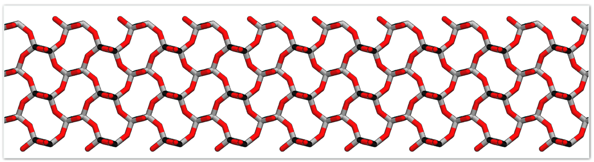
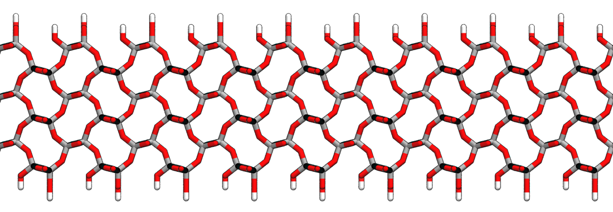

# Silica Model
## Description
Here I provide python scripts that creates Gromacs `itp` files for simulatig  &alpha;-cristobalite silica surface. The forcefield parameters assigned based on [ this paper ](https://pubs.acs.org/doi/10.1021/cm500365c). This repository contains following files:
1. `unitcell.gro`: Unitcell of &alpha;-cristobalite

2. `modify_silica_gro.py`: A python script that takes a `.gro` file of an &alpha;-cristobalite as input and modifies atom names, adds missing surface oxygens and protonates the surface based on an input protonation fraction.  

3. `create_itp_silica.py`: A python script that takes as input the output of previos script and creates an `itp` file. The parameters used are those compatible with AMBER forcefield.

4. Example Gromacs input files to simulate silica-water interface.

## Requirements
1. Python >3.8, MDAnalysis, Numpy and Gromacs.

## Getting Started
The following commands assume that you have the first three files mentioned in the description in the present working directory.

1. Use the Gromacs `genconf` command to create an &alpha;-cristobalite crystal of required size.
         
         gmx genconf -f unitcell.gro -nbox 11 5 8 -o lattice.gro

 

Figure 1: <em>&alpha;-cristobalite Unitcell </em>

3. Rotate the above crystal to expose the **100** plane normal to the z-direction. To do so, note the box dimensions from the above output file `lattice.gro`. Lets say the dimensions are ` bx`, `by` and `bz`,

         gmx editconf -f lattice.gro -rotate 90 0 0 -c -box bx bz 7 -o box.gro

Where, the box dimension is 7 nm in z-direction. 

   

 Figure 2: <em>&alpha;-cristobalite lattice with 100 plane exposed to z-direction. Note that some surface silicon has oxygens missing. </em>

3. Modify the above output file `box.gro` to add missing surface oxygen, change atom names and to protonate random fraction of surface oxygens. 

         python modify_silica_gro.py -f box.gro -o final_silica.gro -hf 91 
Where, `-hf` flag protonates certian percentage of surface oxygen. Here, 91 % of surface oxygen is protonated

   

 Figure 3: <em> Final &alpha;-cristobalite lattice with 100 plane exposed to z-direction. Missing surface oxygens added and a fracton of surface oxygens are protonated. The top and bottom surfaces are protonated by same fraction. </em>

4. Finally, create an `itp` file for the above setup.

         python create_itp_silica.py -f final_silica.gro -o silica.itp
         
